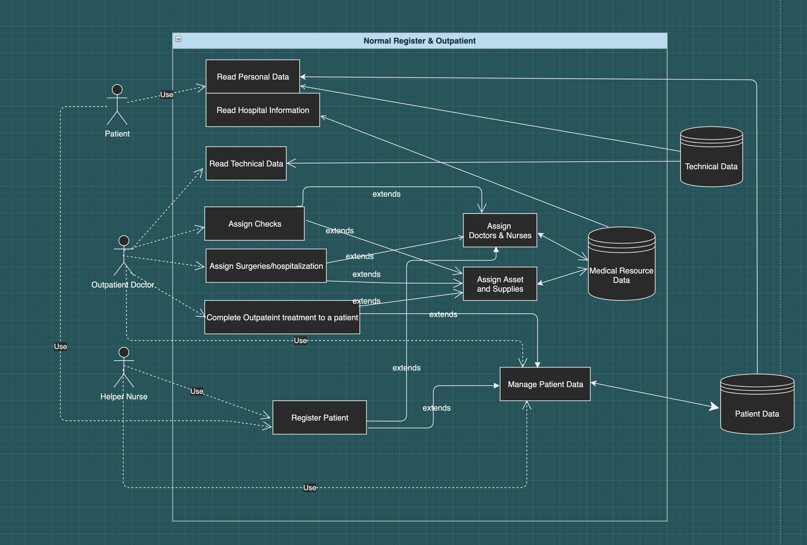
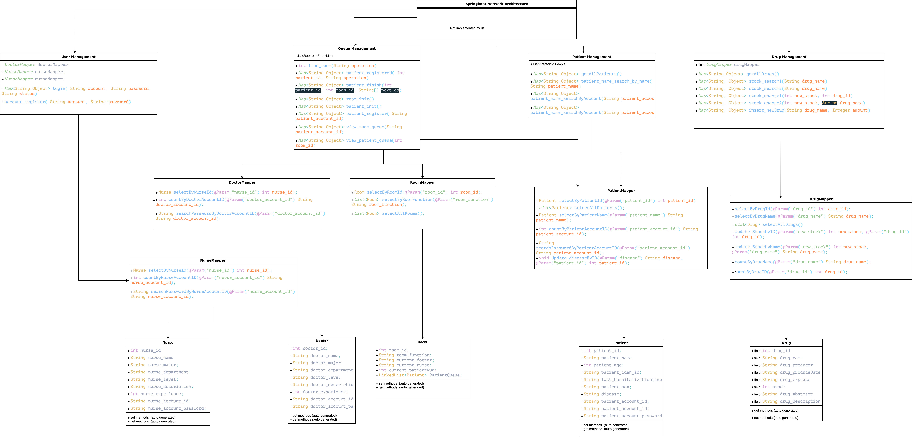
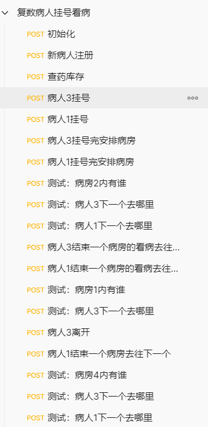

# Final Delivery
- [Final Delivery](#final-delivery)
  - [1. Description of Project](#1-description-of-project)
  - [2. Process](#2-process)
    - [Collaboration and Responsibility](#collaboration-and-responsibility)
    - [Development Process](#development-process)
  - [3. Requirements & Specifications](#3-requirements--specifications)
    - [Simple Use Case: Normal Register & Outpatient](#simple-use-case-normal-register--outpatient)
    - [Use Case Diagram Specifications](#use-case-diagram-specifications)
    - [Normal Register & Outpatient Scene vs. Register & Operation Scene](#normal-register--outpatient-scene-vs-register--operation-scene)
    - [Normal Register & Outpatient Scene](#normal-register--outpatient-scene)
      - [Read Personal Data](#read-personal-data)
      - [Complete Outpatinet Treatment to a Patient](#complete-outpatinet-treatment-to-a-patient)
      - [Register Patient](#register-patient)
    - [Operation Scene](#operation-scene)
      - [Complete Operational Treatment to a Patient](#complete-operational-treatment-to-a-patient)
  - [4. Design and Architecture](#4-design-and-architecture)
    - [Class Diagram](#class-diagram)
    - [Test Method](#test-method)
    - [Backend APIs](#backend-apis)
  - [5. Personal Relflections](#5-personal-relflections)
    - [Relflections (Lessons Learned)](#relflections-lessons-learned)

## 1. Description of Project
We are discussing the main usage of a Medical Health System, when a patient enters the hospital and go to a doctor.

This task is conceptually simple for the users. The users in our case are categorized into three genres, which are patients, doctors, and nurses.

For Patient:
- The patient read information from the Information system, and follows the instructions from the information center. (like go to room 201 for Doctor Zhao, or go to blood test department for a blood test)

For Outpatient Doctor:
- The Doctor gets a glimpse of  queue of patients, and write instructions for the patient. (like: I have 20 patients ahead and I will assign patient 1 for a blood test and medicine A).
- The Doctor can give prescription for patient. They can either do it by assigning surgery/hospitalization.
- At the end of the outpatient procedure, the doctor can assign check.

For Nurse:
- The Nurse can access the patient's personal data center to know their health condition and check doctors' prescription. (For example, they can know what the patient allergic for, and which medicine should they take)

## 2. Process
### Collaboration and Responsibility
Front end: Ruixiang Han.

Middle end: Yang Zhao.

Back end: Siyan Li.
### Development Process

We develop the front and back end separately and independently. We use agile development. 

Every two weeks is an iteration and we have one meeting on each weekend.
During the first several iterations we were quite ambitious because the independent development seemed to work well.  
However, when the time came to our connection between front and back ends, we meet unexpected problem, 
especially for the login function.   
Also, because we have no prior expereience 
about react and spring-boot before this course, we struggle a lot in learning those architectures.
We were actually designing at the same time we are programming.
We belive that it was a big mistake that we started from 
scratch. The front end react was so difficult that we struggled in it a lot. 

- Agile development requires strong cooperations, for example 
  - The distribution of work (based on member skill level) 
  - The goal to achieve (based on project progress control)
  - The meetings target (based on expectation)

Here is a [linked to our team log](https://docs.google.com/document/d/1CIlXrVjjtTmOzWw4o1IZmBANy0ODB7YPJ7iImVi9-Jc/edit#) , you can have more detailed information by reading our team log.

## 3. Requirements & Specifications 
### Simple Use Case: Normal Register & Outpatient
Here is an example for the a Normal Register & Outpatient.
In this example, patient Jerry has a cold and goes to the hospital.

1. Patient Jerry goes to the register office, a helper nurse register his information and assign him to Doctor Tom
3. Patient Jerry reads instructions containing information: "Go to Doc Tom's office in room 309"
4. Doctor Tom reads the information of Patient Jerry in his TODO list.
5. When Doctor Tom is available, he outpatient Patient Jerry.
7. Doctor Tom completes output patient to Patient Jerry and assigns patient Jerry with instructions and medicine.
8. Patient Jerry reads instruction: "Go to room 101 (medicine office) for medicine Lianhuaqingwen"
9. Then patient Jerrry leaves the hospital.

### Use Case Diagram Specifications

This is our use case Diagram

    
     
    
Diagram 1: General usecase diagram

Here are some details about each use case.

### Normal Register & Outpatient Scene vs. Register & Operation Scene

Normal Register & Outpatient describe the process when a patient go to a doctor siiting in a chair. 
The doctor make medical judegments and assign an operation,(like checks, surgeries and so on).
During this process, the patient is only examined but not physically cured.

Register & Operation is the process when a patient is performed medical operation (like a blood check test, or a heart surgery).
During this operation, the patient is physically checked and cured. 
However, the doctors does not make comprehensive judgements to the patient.

### Normal Register & Outpatient Scene

    
     
    
Diagram 2: TheNormal Register & Outpatient scene

In this scene, several properties should be available:

#### Read Personal Data
The patient should be able to read personal data and instructions.

The personal data should consider (at least) these categories of information:
|  patient_name| patient_age  | patient_id | disease |
| --|  -- | --  | --  |
|  Yang Zhao  |20   | 879124 | Heart Attack     |

#### Complete Outpatinet Treatment to a Patient
Outpatient Treatment refers to the treatment done at a table. 
To complete this treatment result in two result
1. the patient leaves the hospital with medicine and instructions
2. The patient goes to Surgeries/Hospitalization

#### Register Patient
A helper nurse will help the patient to register (write in user information, look up historical information, assign an doctor).

### Operation Scene
Add the patient to a room.

#### Complete Operational Treatment to a Patient
Remove the patient from the current Queue.

## 4. Design and Architecture 

Our middle end and back end uses springboot framework.

Web Framework Springboot is based on the Model-View-Controller pattern.
Our models classes are the the `Doctor`, `Patient`, `Nurse`, and `Room` classes.
Our models follows the myBatis dependency to interface with our local mySql database.

Our project contains 3 parts:
1. Controller folder   
  The controller classes will set up the api of the website.    
  For instance, if we want to insert a new drug, we can type the website 'localhost:8080/Drug/insert_newDrug'.
  The location and functionality are declared in the controller class.
2. model folder   
   This folder contains the DAO classes for our project.   
   During runtime, the instances of these classes will be created
   and store data from the database.   
   They are data blocks that contain information like `patient_name`.
3. mapper folder    
   The mapper classes will connect the Springboot project to the backend.   
   In other words, it serves to get data from the mySql database.
   The methods in the mapper classes will be automatically generated.

### Class Diagram 

    
     
    
Diagram 3: Class Diagram  

Since we have the Springboot architecture, web connection is not part of our code.
At the top of the class diagram, we represent Spring-boot architecture with a big box.

The four classes at the top `PatientManagement` ,`DrugManagement`, `QueueManagement` ,and `UserManagement` , are the classes in the Controller folder.

`PatientManagement` utilize `PatientMapper`, which supports search, view, and add functionality for the instance of `Patient`.

`DrugManagement` utilize `DrugManagement`, which supports search, view, and add functionality for the instances of `Drug`.

`UserManagement` utilize `UserManagement`, which supports search, view, and add functionality for the instances of `Drug`.

To see how these functions exaclty works, please read the code of classes: `PatientManagement`, `DrugManagement`, `UserManagement`, or look at the APIs listed below.

The `QueueManagement` is more complicated.
In general, it serves as a queueing system for the patients. 
Each user will have a list of rooms to go to (like doctor office, surgery room, and medicine room).
Also, for each room, it will contain a list of patients that are going to go to this room.
The `QueueManagement` class manages these 2 queues.   
Therefore, utilize `DoctorMapper`, `PatientMapper` and `RoomMapper` because it is necessary to use all these information.
The `***Mapper` interfaces act like DAO to access and modify the database. 

### Test Method
For the development of every little component, we use unit test to test it. Also, we use the software “postman” to perform automatic test. In postman, I made several sequence of API running. Each sequence represents a different path of program running. “Postman” can help to run our backend program in the sequence that is preset by us. Then we can look at the returning value to see whether the program is running as what we want it to run. The postman file is attached in postman_test.zip.
Diagram 4 shows a complex path of test program running.

    
     
    
Diagram 4: Test example  

### Backend APIs
Backend important APIs

Login：登录

	“/user/login”:
		Parameter: 	
                    String account // 账号
                    String password // 密码
                    String status // 登陆者身份：nurse/doctor/patient/guest
		Return value:	Map<String,Object>:	
                                            “success”, “login status: <status>”
                                            “failure”, “account not found!”
                                            “failure”, “wrong password!”

Patient account registration (Permission: all status)：//病人账号注册（权限：所有人）
	
    “/user/account_register”:
		Parameter:	
                    String account //账号
                    String password //密码
		Return value: Map<String,Object>: 	
                                        “error”, ” account already exists!”
                                        “success”, ” account successfully created!”
		Action: put new registered patient’s information in the database

Procedure：//看病流程

Intialization of rooms：// 初始化

	“/Queue/init”:
		Parameter:	None
		Return value: Map<String,Object>: “result: ”, ” successful initialization!”

Patient registration (Permission: doctor, nurse): // 病人挂号（权限：医生，护士）：

	“/Queue/patient_register”:
		Parameter: 	patient_account_id
		Return value:	Map<String,Object>: “error: ”, “patient not found!” // if patient account is not in the database
                                                “success: ”,”patient registered”  // else
		Action: put the patient’s instance to the current “in-hospital” patient_list. // 将该病人的instance加入当前活跃的patient_list当中

Assign room to the registered patient (Permission doctor, nurse): //病人挂完号后给其分配房间（权限：医生，护士）：
	
    “/Queue/patient_registered”:
		Parameter:	
                    int patient_id
                    String operation // patient 病人下一步要做的事情
		Return value: Map<String, Object> "result: ","patient is added to the queue after registration!"
		Action: Add the next room to the patient’s RoomeQueue, and add the patient to the corresponding room’s PatientQueue. // 给病人的RoomQueue加上下一个房间，并给相应房间的PatientQueue加上此病人。

Patient leaves a room: // 病人离开一个房间（权限：医生，护士）

	“/Queue /patient_finish”:
		Parameter: 	
                        int patient_id
                        int room_id // the room patient is leaving
                        String[] next operation //病人接下来要做的事情
		Return value:	Map<String,Object>:	"result:","the patient can leave!" // 若病人没有要做的事情了
                                                    "success", "next operations successfully inserted" // 病人被安排到接下来的对应房间
		Action:	病人的Queue中移除此房间，根据next_op增加之后要去的房间.
				对应房间的Queue加入此病人。

Information access and modify: 信息获取和修改：

Get all patient’s information in the database: // 获取所有数据库里病人的信息：

	“/Patient /getAllPatients”:
		Parameter: None
		Return value: Map<String, Object> : “patients",list_of_patients
	
Get a patient from the patient_id: //根据patient_id获取数据库里某个病人的信息：

	“/Patient/patient_search_by_patient_id”:
		Parameter: int patient_id
		Return value: Map<String, Object> “patient", instance of that patient

Get a patient’s id from the patient_account_id: // 根据patient_account_id获取数据库里某个病人的patient_id：
	
    “Patient /patient_id_searchByAccount”:
		Parameter: String patient_account_id
		Return value: Map<String, Object> “id", patient_id of the patient

Get information of all drugs:
	
    “/Drug/ /getAllDrugs”
		Parameter: None
		Return value: Map<String, Object> “list",list_of_drugs

Insert a new drug to database:
	
    “/Drug/insert_newDrug”
		Parameter: 
                    String drug_name
                    Int amount
		Return value: Map<String, Object> ("result","already exist, increment!") if already exists
                                              ("result","successful insertion!") otherwise.
		Action: insert the new Drug with its amount into the database

Stock change of a drug:

	“/Drug/stock_change2”
		Parameter: 
                    int new_stock
                    String drug_name
		Return value: Map<String, Object>: "result","success!". "failure", "no such drug in record!" If no such drug in database.

## 5. Personal Relflections
### Relflections (Lessons Learned)

Since our group members have different technical backgrounds and different work,
it is difficult for our group members to communicate with each other.
1. We have difficulty of helping each other to learn the architecture (react and springboot)
2. Our goals are progress are hard to manage because lack of architectural knowledge
3. We somehow managaed with a working system eventually, but proabably not the most well-organized way (especially frontend)
4. We need a through evaluation of the difficulty of the project, or else the project will ends up with bad progress control.
5. The requirement analysis is helpful, but does not resovle all technical problems
6. The group members should help each othe and take more responsibility when one of the members is in trouble. 
7. A course teaching Github usage should be necessary for computer science major. 
8. Even though design patterns will significantly organize the project, it is still difficult to implement design patterns in actual project.
9. For our simple project, it is quite difficult to use test methods except for unit tests. 
10. It might be easier to build our frontend if we start from Third Party projects.
11. Since Springboot is already an complete architecture, coding backend is very simple for our project.
12. However, even though we finished the backend, the frontend is not implemented well because of techical issues and communication issues.

